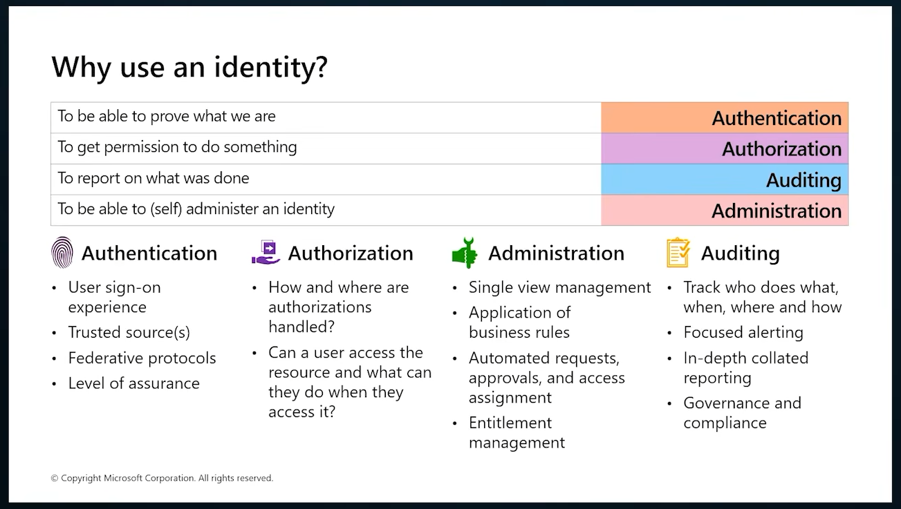
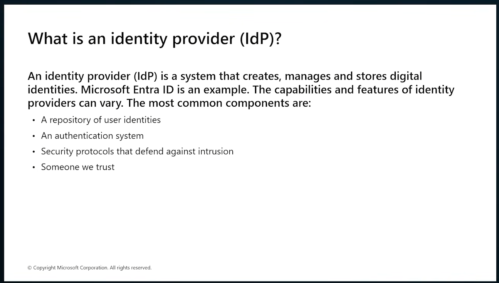
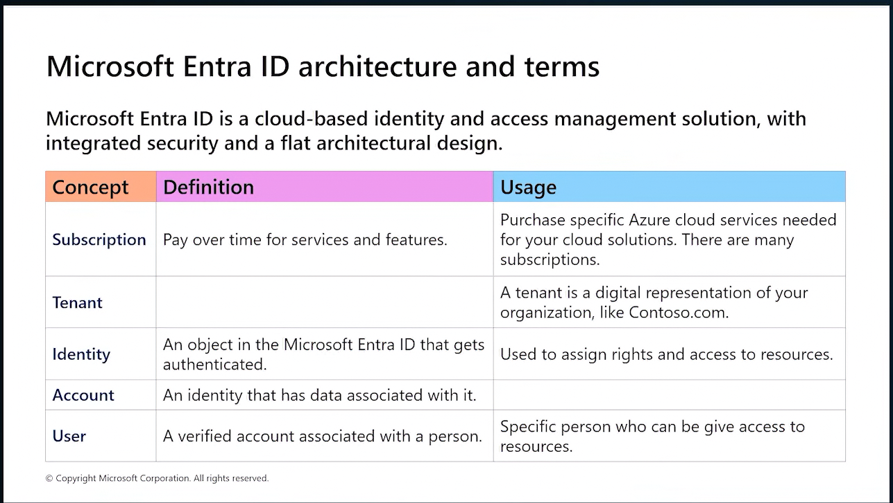
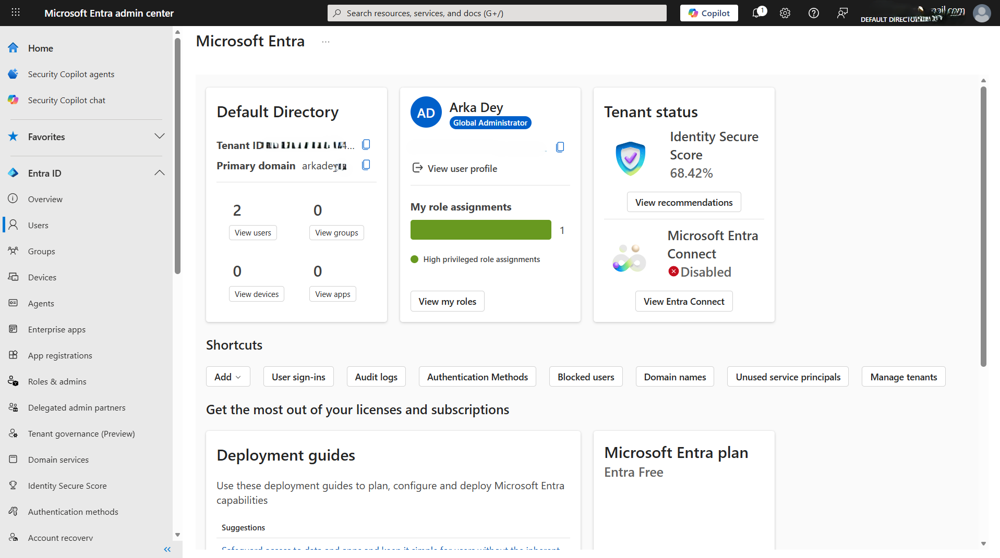
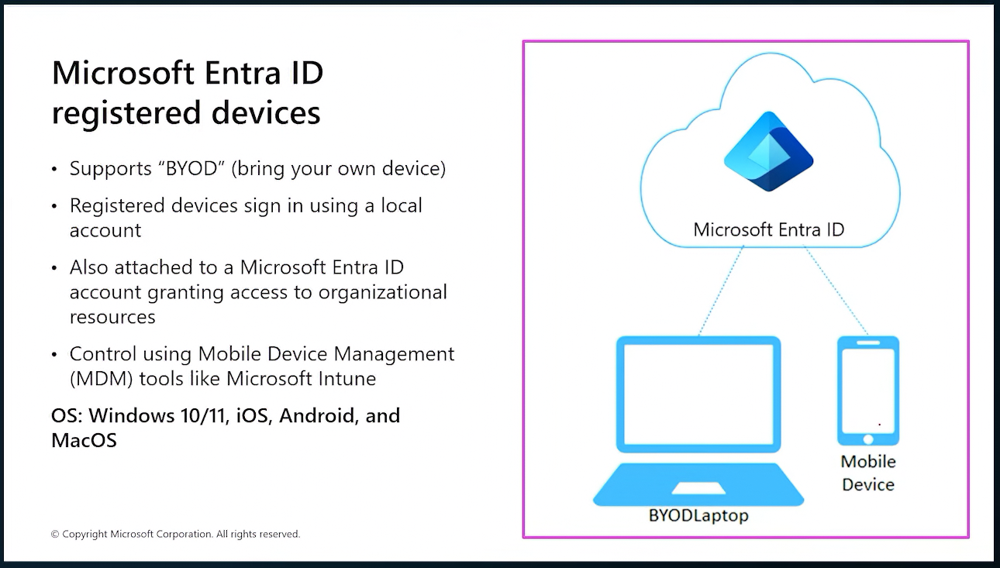
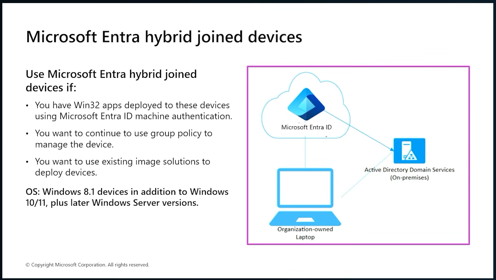

#### My personal study notes for the Microsoft SC-300: Microsoft Identity and Access Administrator certification. These notes cover key concepts, configurations, and practical insights related to Microsoft Entra ID, identity governance, authentication, authorization, and access management. Maintained as a structured reference for learning, revision, and exam preparation.

## 1. Why use an identity.?

---
## 2. Identity Provider (IDP)

---
## 3. Entra ID

---
## 4. Managing groups in Entra ID

### Types of groups:

#### i. Security Groups: 
- Used to manage access to applications, resources, and permissions.
- Members can be users, devices, service principals, and other groups (depending on configuration).
- Commonly used for Role-Based Access Control (RBAC) and resource authorization.

#### ii. Microsoft 365 Group

- Provides collaboration features in addition to membership management.
- Automatically creates shared resources such as:
    - Outlook mailbox
    - Calendar
    - SharePoint site
    - Teams workspace (when integrated)
- Members are typically users only.

#### -> Users can't be manually added in a dynamic group. 
---
## 5. Entra ID registered devices:

---
## 6. Entra roles

## 7. Licenses

#### Microsoft Entra ID Free

- Included with Microsoft 365 subscriptions.
- Basic user and group management.
- Self-service password change.
- Single Sign-On (SSO) for Microsoft cloud applications.
- Basic security and reporting.

---

#### Microsoft Entra ID P1 (Premium P1)

- Includes everything in Free.
- Dynamic groups.
- Self-Service Password Reset (SSPR) with writeback.
- Conditional Access policies.
- Hybrid identity management.
- Automatic user provisioning to SaaS applications.
- Group-based license assignment.

**Commonly used by:** Organizations implementing IAM and Zero Trust fundamentals.

---

#### Microsoft Entra ID P2 (Premium P2)

- Includes everything in P1.
- Identity Protection.
- Risk-based Conditional Access.
- Privileged Identity Management (PIM).
- Access Reviews.
- Entitlement Management.
- Advanced security reporting and analytics.

**Commonly used by:** Enterprises requiring privileged access governance and advanced identity security.

---

### Microsoft 365 E3

Microsoft 365 E3 includes:

- Microsoft Entra ID P1.
- Office desktop applications.
- Exchange Online.
- SharePoint Online.
- OneDrive for Business.
- Microsoft Teams.
- Basic compliance and security features.

**Entra License Included:** P1

---

### Microsoft 365 E5

Microsoft 365 E5 includes:

- Everything in E3.
- Microsoft Entra ID P2.
- Microsoft Defender suite.
- Microsoft Defender for Endpoint.
- Microsoft Defender for Office 365.
- Microsoft Defender for Identity.
- Microsoft Purview advanced compliance features.
- Advanced auditing and analytics.

**Entra License Included:** P2
